# 🚀 Using Graphical user interface

Graphical user interface is a web app, executed through web browser.
Once installed and started, it works locally and is accessible at the url http://localhost:5000

## 📚 Application content

Application is composed of 2 main pages :
- `Projects management` page, to manage available use cases list.
    * Create, edit and delete use cases
    * Load Project => switch to `Project edit` page below

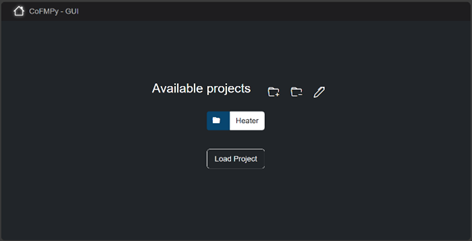

- `Project edit` page composed of different sections :
    * General cosimulation information
    * FMUs information
      * Add FMUs
      * Edit FMU caracteristics and initializations
    * Connections to manage links between FMUs

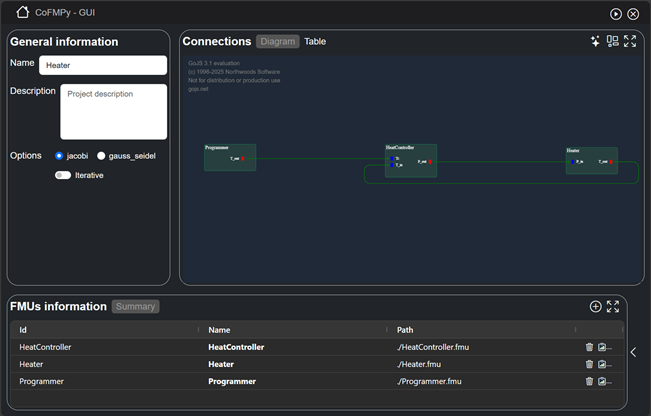

## 🐍 User guide - Workflow

HMI is designed to be very simple and intuitive, follow steps below to obtain configuration file and execute cosimulation with CoFmuPy.

### 1. Create use case
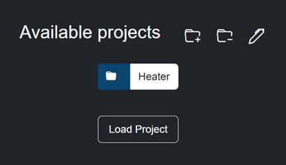  

### 2. Empty page after use creation
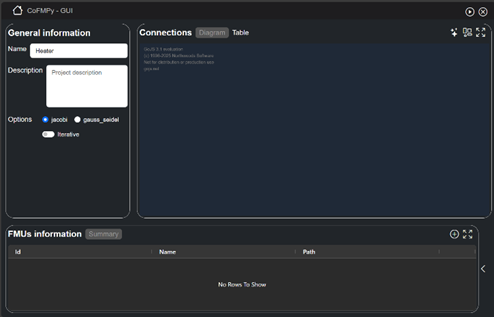

### 3. Select simulation options
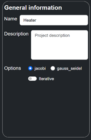

### 4. Add fmu by selecting `+` button
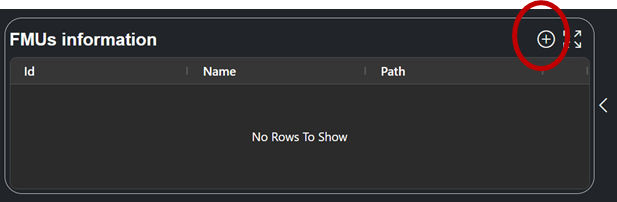

### 5. Select fmu file (or drop), edit characteristics and clic on upload fmu button
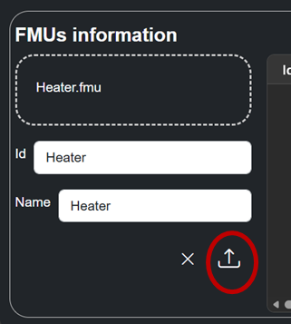  
Repeat operations 4 and 5 for each expected FMU

### 6. Edit fmu parameters or characteristics
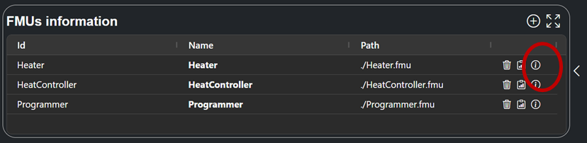

### 7. Check fmu options and change parameters or input for initial co-simulation state
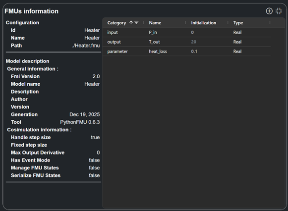

### 8. Edit connections between fmus
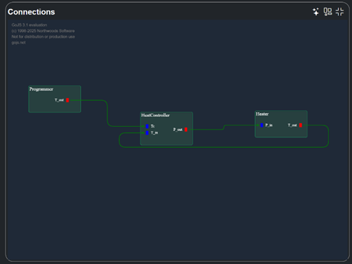

### 9. Start co-simulation, select step size and simulation duration
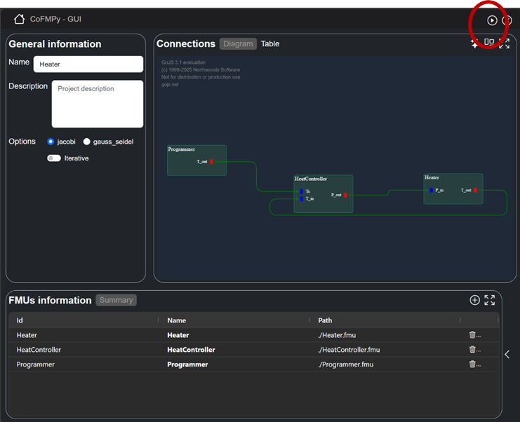

Created Use case is stored into `Projects` directory where start-gui script has been executed.
Hereafter the content of the use case directory.  
``` bash
Heater/
├─ config.json              # Created configuration file
├─ HeatController.fmu
├─ Heater.fmu
├─ metadata.json            # Metadata file, only useful for Hmi
├─ Programmer.fmu
├─ results_simulation.csv   # Simulation results ; all fmus outputs
└─ Script_Analyse.py
```

For more advanced configuration (input or output streams, storage, ...) You can edit config.json file before start simulation
For more control on simulation execution, you can also switch to script mode using the created config.json file (see [Getting started page](../getting_started.md))
